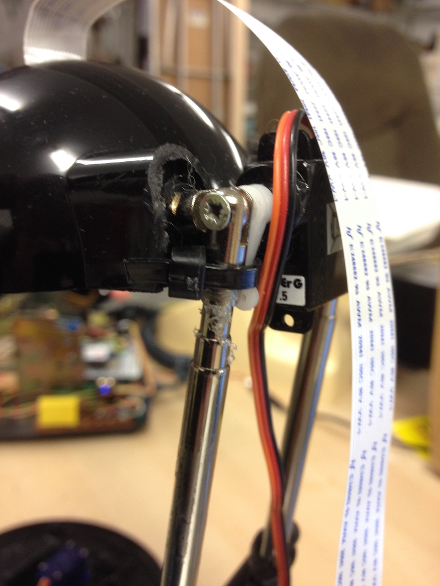

# Introduction

This is a bit complicated, but fun!

The idea is to hollow out the base to fit a Pi and and Arduino in it, and 
fit tiny servos to the top part (the 'head') and the base.

## Modify the case

Take your EXPRESSIVIO lamp, making sure it's unplugged from the mains 
obviously, unscrew the base and remove the transformer and related 
pieces, toegther with the power cable.

Remove the glass plate from the top, the bulb and any bits of wires 
connected to it.

Snap off the inside segments of the base to make as much room as you can.

Carefully saw the backs off the top arial covers. But don't saw off too much....

Saw or dremel a hole in the back of the base. This needs to be wide and 
deep enough to get a USB cable and a wifi camera cable into (it's also 
sometimes useful to be able to get the Ethernet cable in too if possible).

Dremel two holes in the centre of the flat base panel such that the servo 
exactly fits. 

You'll also need to saw a small wedge out of the base to fit the power supply cable in. 
It's easier to do this at the end - see below.

## Connect the top servo

This is extra fiddly.

Make sure your servo is at its minimal point, e.g.

 * flash the arduino with the code in [arduino](/arduino)
 * connect the servo to 5V, GND and D3 (orange)
 * in the serial part of the arduino IDE type "1 0" and "1 180" to check that the servo is going from min to max in the right direction

Move the lamp so its head is as far bowed as it will go.

Replace the right hand screw at the top of the lamp with a servo and a 
screw through its spindle (you'll need to find a screw that's a bit longer 
than the usual one). Cable tie the servo's white plastic bit (the 'horn') 
to the downward arial. Loosen the other screw so it is mobile.

Glue the flat plastic piece between the servo and the bottom of the lamp top.

Test the servo again

## Connect the bottom servo

 * connect the servo to 5V, GND and D4 (orange)
 * Figure out where 90 degrees is (using ("2 90") in serial)

Place that point at the front of the lamp.

Wedge the servo into the holes you made, gluegunning it in as well.

Test the servo again.

## Connect the arduino and the Pi

We're using a serial connection to save space.

On the arduino you should have the top servo connected to pin D3 and the other to 
pin D4.

Connect:
 * 5v on pi to 5v on the arduino (e.g. [GPIO physical numbering](https://www.raspberrypi.org/documentation/usage/gpio/) 2 or 4)
 * ground on the pi to ground on the arduino (e.g. GPIO physical numbering 6, 9 etc)
 * pi's TDX (GPIO physical numbering pin 8) to arduino's RX

Normally you'd [need a voltage 
divider](https://oscarliang.com/raspberry-pi-and-arduino-connected-serial-gpio/) 
to do this serial communication, but because we're only going one way - from the 
pi to the arduino - we get away with it.

Stick or rest the breadboard to the back of the Pi.

## Add the camera

Carefully make a slit in the aluminum case at the top and thread the extra 
long camera cable through it. Connect and position the camera, screwing it 
(using plastic screws if you do) or glueing it into place.

Feed the other end into the slot you made in the base and attach it to the 
pi (making sure the pi is unplugged and that you're connecting it the right 
way round.)

## Connect everything together

This is quite a wedge and it's why you need the smallest 9g servo you can find.

Basically the pi goes in the bottom at an angle with the breadboard underneath the Pi.
It needs to be placed at a downward angle so that the USB port is accessble 
through the slot, and so that there's room for the servo.

First, make sure you've programmed the arduino and got the pi on the network you 
want to use it on, and that you've connected the Arduino via serial to the PI (see 
above). You can't reprogramme the arduino once it's in because it can't be 
programmed with the serial attached.

Connect the power cable to the PI, and, making sure you have the lamp base the 
right way round (there's a notch at the back) carefully mark and saw a wedge out 
of the base for it to fit. It must not be forced or bend! You may also need to saw 
off the top of one of the base plate's screw casings (make sure you get the right 
one).

Replace the bottom plate - you may need to twist it slightly to get it on its 
rails. Screw it on, omitting the screw where you removed the base plate. Glue the 
servo horn part to the CD base and add rubber feet.

If you have laser cut the base components in the 
[laser_cut_base](laser_cut_base/) directory, glue the servo horn to base 1, 
glue base 2 to base 1, put the ball bearings in the holes and attach the 
two parts of the servo together, screwing them in.

If all is well, you're ready to go. Plug it in!

